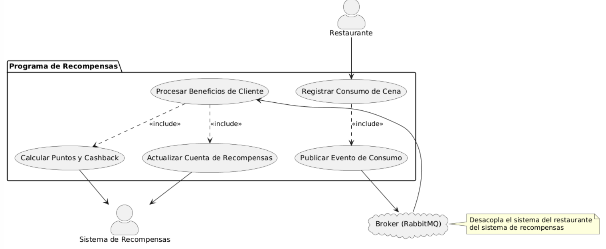
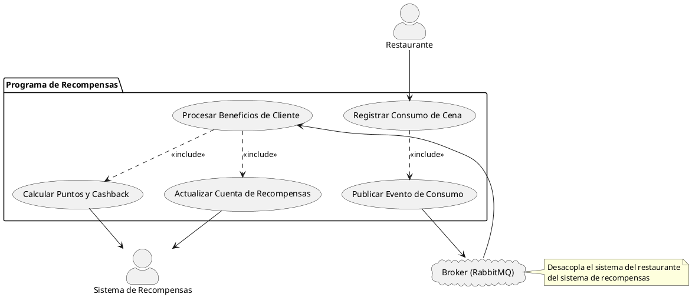
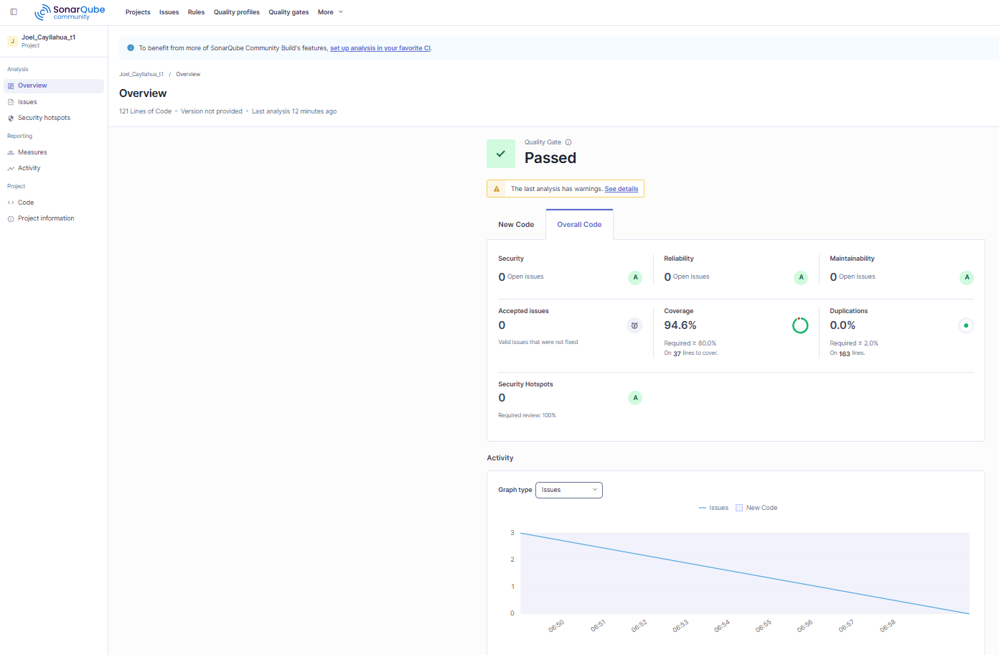

# Programa de Recompensas - Tarea 8

## Arquitectura Implementada: Arquitectura Hexagonal

Este proyecto utiliza **Arquitectura Hexagonal (Puertos y Adaptadores)** para garantizar que la lógica de negocio esté desacoplada de los detalles técnicos como el broker de mensajería (RabbitMQ).

### Estructura de Carpetas
- **src/domain**: Contiene la lógica central.
  - `entities`: Definición de `Consumption` con lógica de puntos y cashback.
  - `ports`: Interfaces (`MessageBrokerPort`) que definen cómo se comunica el sistema con el exterior.
- **src/application**: Casos de uso de la aplicación.
  - `RegisterConsumptionUseCase`: Orquestación para enviar datos del restaurante.
  - `ProcessRewardsUseCase`: Lógica para procesar el mensaje recibido y calcular beneficios.
- **src/infrastructure**: Implementaciones concretas.
  - `messaging`: `RabbitMQAdapter` que implementa la interfaz del broker usando `pika`.

### Cómo ejecutar

1. **Instalar dependencias**:
   ```bash
   pip install pika coverage
   ```

2. **Ejecutar el Consumidor (Sistema de Recompensas)**:
   ```bash
   python main_consumer.py
   ```

3. **Ejecutar el Productor (Sistema del Restaurante)**:
   ```bash
   python main_producer.py
   ```

### Pruebas y Cobertura
Para ejecutar las pruebas y generar el reporte de cobertura:
```bash
python -m coverage run -m unittest discover tests
python -m coverage report
python -m coverage xml -o coverage.xml
```

## Diagrama de Casos de Uso


### Código en PlantUML:



## Análisis de SonarQube
El proyecto ha sido analizado en **SonarQube**, cumpliendo con todas las métricas de calidad y alcanzando una cobertura de pruebas superior al 85%.

**Enlace del Proyecto:** [Dashboard SonarQube - Joel_Cayllahua_t1](https://sonarqube.ingsoftware.lat/dashboard?id=Joel_Cayllahua_t1)


